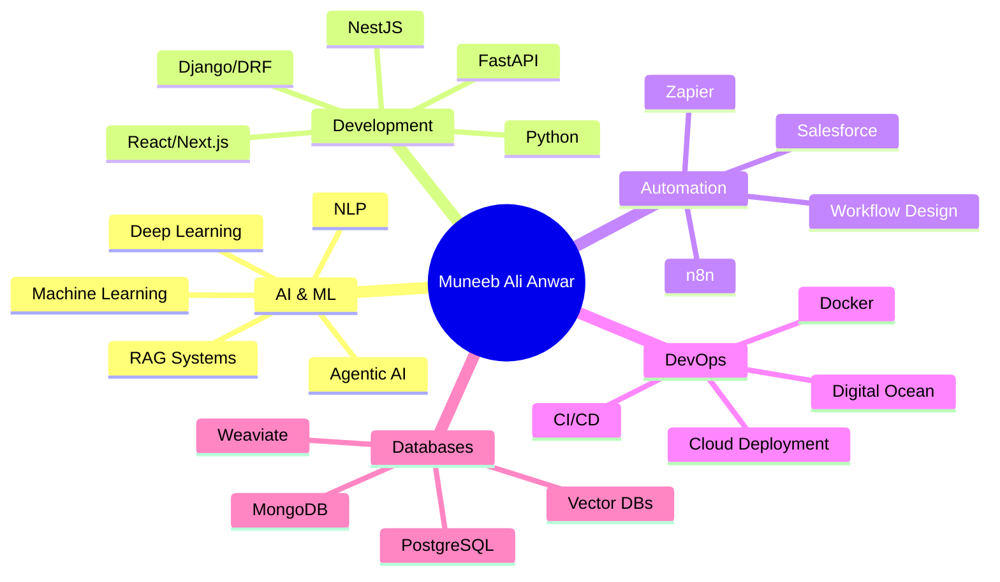

<div align="center">
  
</div>

<div align="center">
  
  <!-- Typing SVG -->
  <a href="https://git.io/typing-svg"></a>

</div>

<p align="center">
  
  
  
</p>

---

## 🚀 About Me

```python
class MuneebAliAnwar:
    def __init__(self):
        self.name = "Muneeb Ali Anwar"
        self.role = "AI Engineering Specialist"
        self.location = "NASTP RAWALPINDI"
        self.company = "GroupsTechSolutions"
        self.email = "muneebanwar2005@gmail.com"
        
    def expertise(self):
        return {
            "ai_ml": ["Machine Learning", "Deep Learning", "NLP", "RAG Systems"],
            "frameworks": ["LangChain", "LangGraph", "FastAPI", "NestJS"],
            "automation": ["n8n", "Zapier", "Salesforce Integration"],
            "deployment": ["Digital Ocean", "Docker", "CI/CD Pipelines"],
            "databases": ["MongoDB", "PostgreSQL", "Vector DBs", "Weaviate"],
            "learning": ["React", "Next.js", "Django", "DRF"],
            "backend": ["Python", "Node.js", "FastAPI", "Express"]
        }
    
    def current_focus(self):
        return [
            "🤖 Building Agentic AI Systems",
            "🔗 Advanced RAG Implementations",
            "⚡ Workflow Automation Solutions",
            "🎯 Production-Ready AI Applications"
        ]

muneeb = MuneebAliAnwar()
```

---

## 💼 Tech Stack & Expertise

<div align="center">

### 🤖 AI & Machine Learning


### 🧠 AI Frameworks & Tools


### 🔧 Backend & APIs


### 🎨 Frontend (Learning)


### 🗄️ Databases


### ⚡ Automation & Integration


### 🚀 DevOps & Deployment


### 🛠️ Tools & Others


</div>

---

## 📊 GitHub Statistics

<div align="center">
  
  
</div>

<div align="center">
  
</div>

<div align="center">
  
</div>

---

## 🏆 GitHub Trophies

<div align="center">
  
</div>

---

## 🎯 Current Projects & Focus

<div align="center">

| Project Type | Technologies | Status |
|-------------|--------------|--------|
| 🤖 **AI Voice Agents** | LangChain, FastAPI, Twilio | 🚀 Active |
| 🔍 **RAG Systems** | LangGraph, Vector DBs, MongoDB | 🚀 Active |
| ⚡ **Workflow Automation** | n8n, Zapier, Salesforce | 🚀 Active |
| 🏥 **Healthcare AI Platform** | NestJS, AI Agents, Voice | 🚀 Active |
| 🎯 **Insurance Tech** | FastAPI, OCR, Payment Gateway | 🚀 Active |

</div>

---

## 💡 Areas of Expertise

<div align="center">



</div>

---

## 🌟 Featured Repositories

<div align="center">
  <a href="https://github.com/muneebanwar69/nlp-bert-based-semantic-similarity">
    
  </a>
  <a href="https://github.com/muneebanwar69/Media-Marson-AuroMotionProject">
    
  </a>
</div>

---

## 📈 Coding Activity

<!--START_SECTION:waka-->
<!--END_SECTION:waka-->

<div align="center">
  
</div>

---

## 🤝 Connect With Me

<div align="center">
  
[](mailto:muneebanwar2005@gmail.com)
[](https://linkedin.com/in/muneeb-ali-anwar)
[](https://your-portfolio-url.com)
[](https://twitter.com/muneebanwar69)

</div>

---

## 📝 Latest Blog Posts

<!-- BLOG-POST-LIST:START -->
<!-- BLOG-POST-LIST:END -->

---

## 💭 Random Dev Quote

<div align="center">
  
</div>

---

## 🐍 Contribution Snake

<div align="center">
  <picture>
    <source media="(prefers-color-scheme: dark)" srcset="https://raw.githubusercontent.com/muneebanwar69/muneebanwar69/output/github-contribution-grid-snake-dark.svg">
    <source media="(prefers-color-scheme: light)" srcset="https://raw.githubusercontent.com/muneebanwar69/muneebanwar69/output/github-contribution-grid-snake.svg">
    
  </picture>
</div>

---

<div align="center">
  
### 💬 "Transforming ideas into intelligent solutions, one line of code at a time"


</div>

---

<div align="center">
  <sub>⭐️ From <a href="https://github.com/muneebanwar69">Muneeb Ali Anwar</a> | Last Updated: 2025</sub>
</div>
